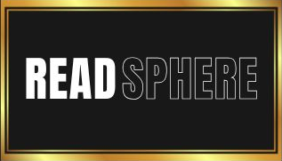

# 📚 ReadSphere - Modern E-Commerce Bookstore API



ReadSphere is a full-featured e-commerce platform for books, built with Go, Gin, PostgreSQL, and GORM. It offers a robust API with comprehensive features for both users and administrators.

[](https://golang.org)
[](https://www.postgresql.org)
[](LICENSE)

## ⚡ Quick Start

```sh
# Clone the repository
git clone https://github.com/Govind-619/ReadSphere.git
cd ReadSphere

# Copy and edit environment variables
cp .env.example .env   # Edit with your credentials

# Install dependencies
go mod tidy

# Run the application
go run main.go
```

## 📖 Documentation

This project's documentation is organized into separate files for better navigation and maintenance:

### 📋 Table of Contents
- [✨ Key Features](docs/features.md) - Comprehensive overview of user and admin features
- [🛠️ Technical Stack](docs/technical-stack.md) - Technologies and dependencies used
- [📦 Project Structure](docs/project-structure.md) - Codebase organization and architecture
- [🚀 API Endpoints](docs/api-endpoints.md) - Complete API reference with all endpoints
- [🚀 Getting Started](docs/getting-started.md) - Installation, setup, and deployment guide
- [📝 Recent Changes](docs/recent-changes.md) - Latest updates and feature additions
- [🤝 Contributing](docs/contributing.md) - How to contribute to the project

## 🎯 Quick Overview

ReadSphere provides a complete e-commerce solution with:

### For Users
- **Authentication**: Email/password with OTP, Google OAuth2
- **Shopping**: Advanced browsing, cart management, wishlist
- **Orders**: Checkout, tracking, cancellation, returns
- **Wallet**: Secure top-ups, transaction history
- **Profile**: Address management, image uploads
- **Referrals**: Unique codes, invitation links, rewards

### For Administrators
- **Dashboard**: Real-time analytics and insights
- **Inventory**: Product and category management
- **Orders**: Status management, return processing
- **Reports**: Sales analytics with PDF/Excel export
- **Users**: Account management and moderation
- **Offers**: Product and category discounts

## 🛠️ Tech Stack

- **Backend**: Go 1.23.0, Gin Framework, GORM
- **Database**: PostgreSQL 12+
- **Authentication**: JWT, Google OAuth2
- **Payments**: Razorpay integration
- **Email**: SMTP with HTML templates
- **File Storage**: Local uploads with image processing

## 🚀 Getting Started

For detailed setup instructions, see our [Getting Started Guide](docs/getting-started.md).

## 📝 License

This project is licensed under the [MIT License](LICENSE).

## 📧 Contact

For questions, support, or feedback, please open an issue or contact the maintainer at [your_email@example.com].

---

**Ready to get started?** Check out our [Getting Started Guide](docs/getting-started.md) or explore the [API Endpoints](docs/api-endpoints.md) to see what ReadSphere can do!